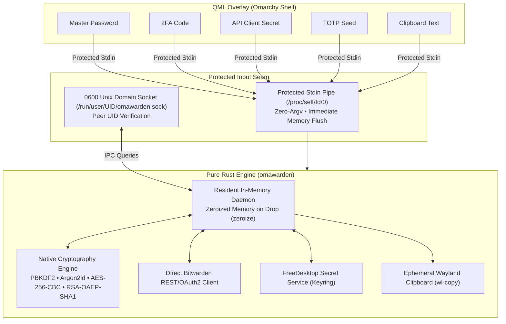

# omarchy-bitwarden

[](LICENSE)
[](https://www.rust-lang.org/)
[](https://github.com/omarchy)

Native, high-performance Bitwarden and Vaultwarden credential manager overlay for the **Omarchy Shell** on Linux / Hyprland, powered by the pure Rust `omawarden` engine.

Inspired by macOS Spotlight and Raycast, `omarchy-bitwarden` provides instantaneous keyboard-driven vault access, secure Keyring session persistence, live TOTP generation, heuristic SSH key detection, and ephemeral clipboard protection with zero external runtime dependencies.


---

## Features

- **Instant Overlay & Zero Latency**: In-memory caching and non-blocking background sync allow opening and searching your entire vault in milliseconds.
- **Pure Rust Native Engine (`omawarden`)**: 100% standalone execution with native cryptographic decryption (PBKDF2, Argon2id, AES-256-CBC, HMAC-SHA256, RSA-OAEP-SHA1), direct REST/OAuth2 API client, and resident memory daemon.
- **Organizations & Collections**: Full decryption of organization-owned credentials using RSA-OAEP-SHA1 organization key unwrapping, displaying `[🏢 Org Name]` badges and collection affiliations.
- **Folders & Soft-Delete Filtering**: Displays `[📁 Folder Name]` badges for categorized entries and automatically skips soft-deleted items (Recycle Bin).
- **Encrypted Binary Attachment Previews**: Downloads and decrypts AES-256-CBC binary attachments locally, providing instant in-overlay previews for images (JPEG, PNG, GIF, WebP, SVG) and text files, plus external viewing with `xdg-open`.
- **Secure Keyring Session Lifecycle**: Decrypted session tokens are stored securely in FreeDesktop Secret Service (`secret-tool` / D-Bus). Auto-locks upon screen lock hooks or idle timeouts without storing cleartext master passwords.
- **Multi-Tier High-Precision Fuzzy Search**: Sub-millisecond ranking algorithm prioritizing exact matches, prefixes, substrings, and acronym subsequences across item names, usernames, notes, and custom fields.
- **Action Palette (<kbd>Ctrl</kbd>+<kbd>K</kbd>)**: Fast keyboard palette to copy usernames, passwords, TOTP codes, card CVVs, SSH keys, PINs, organization/folder names, or launch website URLs.
- **Live Real-time TOTP Token Engine**: Automatic TOTP countdown timer and live 6-digit one-time password generation.
- **Website Favicons & Card Brands**: Asynchronously fetches crisp website favicons for login entries and automatically recognizes payment card brands (Visa, Mastercard, Amex, JCB, UnionPay, Discover).
- **Heuristic SSH Key Management**: Automatically detects SSH private/public key pairs and passphrases in notes or custom fields, exposing them under a dedicated SSH category filter.
- **Ephemeral Wayland Clipboard**: Auto-purges sensitive passwords and tokens from the clipboard after 30 seconds using `wl-copy`.
- **Self-Hosted Vaultwarden Support**: Seamlessly switch between official Bitwarden and custom self-hosted Vaultwarden server instances.

---

## Keyboard Shortcuts

| Shortcut                       | Description                                                               |
| :----------------------------- | :------------------------------------------------------------------------ |
| <kbd>Enter</kbd>               | Copy primary credential (Password / Card Number / Public Key)             |
| <kbd>Ctrl</kbd> + <kbd>U</kbd> | Copy username                                                             |
| <kbd>Ctrl</kbd> + <kbd>T</kbd> | Copy live TOTP code                                                       |
| <kbd>Ctrl</kbd> + <kbd>O</kbd> | Open primary website URL in default browser                               |
| <kbd>Ctrl</kbd> + <kbd>K</kbd> | Open Action Palette (Copy username, TOTP, PIN, Org Name, etc.)            |
| <kbd>Ctrl</kbd> + <kbd>,</kbd> | Open / Toggle Settings configuration view                                 |
| <kbd>Ctrl</kbd> + <kbd>L</kbd> | Manually lock the vault immediately                                       |
| <kbd>Ctrl</kbd> + <kbd>R</kbd> | Trigger manual vault sync with Bitwarden server                           |
| <kbd>↓</kbd> / <kbd>↑</kbd>    | Navigate item list or action options (stops at boundaries)                |
| <kbd>Tab</kbd>                 | Switch category filters (All, Logins, Cards, Identities, Notes, SSH Keys) |
| <kbd>Esc</kbd>                 | Dismiss Action Palette, Settings, or hide the overlay                     |

---

## Prerequisites

Ensure the following tools are available on your system:

- **Keyring / Secret Service**: `secret-tool` (`libsecret` package on Arch/Debian/Fedora)
- **Wayland Clipboard**: `wl-clipboard` (`wl-copy` / `wl-paste`)

---

## Installation & Setup

1. **Clone or Link to Omarchy Plugins Directory**:

```bash
git clone https://github.com/icyleaf/omarchy-bitwarden.git ~/.config/omarchy/plugins/icyleaf.bitwarden
```

2. **Reload Omarchy Shell Plugins**:

```bash
omarchy-shell shell rescanPlugins
```

3. **Toggle Overlay**:

```bash
omarchy-shell shell toggle icyleaf.bitwarden
```

4. **Bind a Global Hotkey** (in `~/.config/hypr/bindings.lua`):

```lua
-- ~/.config/hypr/bindings.lua
o.bind("SUPER + slash", "Omarchy Bitwarden", "omarchy-shell shell toggle icyleaf.bitwarden")
```

5. **Set window rule**:

```lua
o.window({ class = "org.quickshell", title = "(Bitwarden)" }, {
  float = true,
  center = true,
  size = { 1152, 768 }
})
```

---

## Authentication Methods

`omarchy-bitwarden` supports two authentication methods for connecting to Bitwarden or self-hosted Vaultwarden instances:

### 1. Master Password Login (+ 2FA Support)

- **Default & Direct**: Enter your account email and Master Password directly in the overlay login form.
- **Two-Factor Authentication (2FA)**: If your account has two-step login enabled, an inline **2FA Code** field will appear automatically upon challenge. Enter your 6-digit TOTP code (or email verification code) to complete authentication.
- **Remember Email**: Optionally toggle "Remember Email" to prefill your login email address across sessions.

### 2. API Key Login (Personal API Key)

- **Official Bitwarden CLI Standard**: Recommended for headless environments or accounts with hardware key / Duo 2FA.
- **How to obtain**:
  1. Open the [Bitwarden Web Vault](https://vault.bitwarden.com) (or your self-hosted Vaultwarden instance).
  2. Navigate to **Settings** → **Security** → **Keys** tab.
  3. Click **View API Key** and enter your master password.
  4. Copy your `client_id` (e.g. `user.xxxxxxxx-xxxx-xxxx-xxxx-xxxxxxxxxxxx`) and `client_secret`.
- **In Omarchy Overlay**: Switch the login tab to **API Key**, paste your `client_id` and `client_secret`, and log in. Once authenticated, subsequent unlocks are completed via your Master Password.

---

## Security Architecture & Privacy Safeguards

`omarchy-bitwarden` is engineered with a strict **zero-trust, descriptor-isolated security model** to protect your credentials from process snooping, memory dumps, and environment leakage on Linux:



### Key Security Guarantees:

1. **Zero Command-Line (`argv`) Credential Leakage**:
   - Master passwords, client secrets, 2FA codes, TOTP seeds, and clipboard text are **never passed as command-line arguments**.
   - On Linux, `/proc/<pid>/cmdline` is readable by other processes under the same user. By delivering all sensitive data exclusively through **protected stdin streams** or **0600 Unix domain sockets**, command line inspection reveals zero sensitive credentials.

2. **Zero Process Environment (`env`) Secret Spillage**:
   - API client secrets, passwords, and live session tokens are never exported to process environment variables (`/proc/<pid>/environ`).
   - Authentication streams directly negotiate OAuth2 and vault unlock without leaving trace variables in the process environment.

3. **Strict Owner-Only File & Socket Permissions (`0600`)**:
   - Vault cache file (`~/.config/omarchy/plugins/icyleaf.bitwarden/data.json`) and the daemon Unix socket (`/run/user/<UID>/omawarden.sock`) enforce `0600` permissions (readable and writable exclusively by the owner).

4. **Deterministic Zero-Memory Destruction (`zeroize`)**:
   - All cryptographic keys (`SymmetricCryptoKey`), derived master keys, and intermediate hashes implement `zeroize::ZeroizeOnDrop` to overwrite volatile memory with zeros upon drop.
   - When the vault is locked, all decrypted items and keys are immediately purged from daemon memory.

5. **Native FreeDesktop Secret Service Keyring Lifecycle**:
   - Encrypted session tokens are stored securely inside the system Keyring (GNOME Keyring / KWallet / KeePassXC) via D-Bus Secret Service protocols.
   - **No cleartext master passwords are ever written to disk**.
   - Immediate session destruction: Clicking **Lock** (<kbd>Ctrl</kbd>+<kbd>L</kbd>), triggering system screen-lock hooks (`hyprlock`/`swaylock`), or reaching idle timeout instantly clears the session key from Keyring and purges decrypted vault items from memory.

6. **Ephemeral Clipboard Auto-Clearing (30s TTL)**:
   - When copying passwords, TOTP codes, card CVVs, or SSH private keys, sensitive values are piped directly to `wl-copy` without entering shell logs.
   - A dedicated timer daemon automatically clears the Wayland clipboard after 30 seconds (configurable in Settings) to eliminate lingering exposure.

7. **Zero External Runtime Dependencies**:
   - 100% pure Rust binary. No external Node.js, Python, or official `bw` CLI binary is required at runtime.
   - Built-in Git commit SHA handshake (`GIT_HASH`) automatically detects binary updates and restarts resident daemons seamlessly.

---

## Architecture

```
omarchy-bitwarden/
├── OmarchyBitwarden.qml         # Quickshell QML overlay UI & Action Palette
├── manifest.json                # Omarchy plugin manifest metadata
└── omawarden/                   # Pure Rust engine workspace crate
    ├── Cargo.toml               # Rust package dependencies & configuration
    └── src/
        ├── main.rs              # CLI entry point, clap command handlers & stdin bridge
        ├── daemon.rs            # Background resident Unix socket daemon & cache
        ├── api.rs               # Direct REST/OAuth2 Bitwarden client & multi-org decryption
        ├── auth.rs              # Authentication, login & unlock lifecycle
        ├── crypto.rs            # PBKDF2, Argon2id, AES-256-CBC, RSA-OAEP-SHA1 crypto engine
        ├── storage.rs           # Encrypted vault cache persistence (0600 data.json)
        ├── keyring.rs           # FreeDesktop Secret Service Keyring integration
        ├── vault.rs             # In-memory vault parsing, fuzzy scoring & SSH detection
        ├── totp.rs              # RFC 6238 TOTP computation & multi-algorithm engine
        ├── clipboard.rs         # Ephemeral Wayland clipboard manager
        ├── attachment.rs        # Attachment streaming, decryption & preview handling
        ├── health.rs            # Diagnostic health checker
        ├── hook.rs              # Screen-lock auto-lock hook installer
        └── config.rs            # Configuration management (config.json)
```

---

## Building and Testing

### Build from Source

Install cargo with `mise`:

```bash
mise install
```

Build the optimized release binary with `cargo`:

```bash
cd omawarden
mise build-release
mkdir -p bin && cp target/release/omawarden bin/omawarden
```

### Running Tests

Execute the comprehensive unit and integration test suite:

```bash
cargo test
```

### Formatting and Linting

```bash
cargo fmt --check
cargo clippy --all-targets -- -D warnings
```

---

## Multi-Architecture Releases

Tagged releases (`v*`) automatically trigger GitHub Actions matrix builds generating optimized release tarballs and SHA-256 checksums for:

- `x86_64-unknown-linux-gnu` (Intel / AMD 64-bit Linux)
- `aarch64-unknown-linux-gnu` (ARM 64-bit Linux, including Raspberry Pi & Asahi)

---

## License

This project is open-sourced under the [MIT License](LICENSE).
