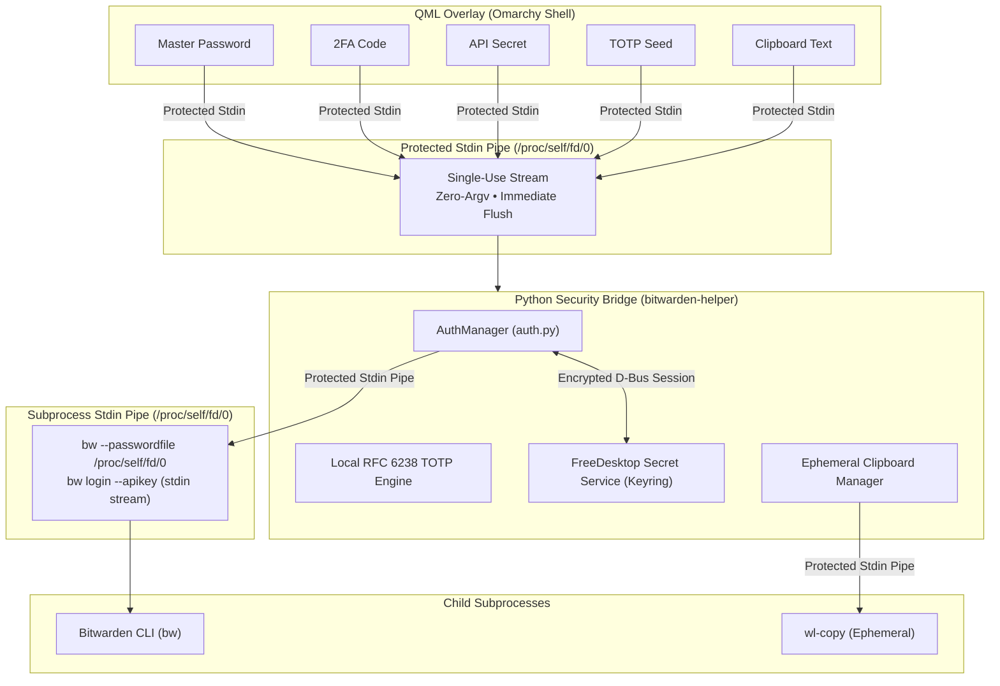

# omarchy-bitwarden

[](LICENSE)
[](https://www.rust-lang.org/)
[](https://github.com/omarchy)

Native, high-performance Bitwarden and Vaultwarden credential manager overlay for the **Omarchy Shell** on Linux / Wayland, powered by the pure Rust `omawarden` engine.

Inspired by macOS Spotlight and Raycast, `omarchy-bitwarden` provides instantaneous keyboard-driven vault access, secure Keyring session persistence, live TOTP generation, heuristic SSH key detection, and ephemeral clipboard protection with zero external runtime dependencies.


---

## Features

- **Instant Overlay & Zero Latency**: In-memory caching and non-blocking background sync allow opening and searching your entire vault in milliseconds.
- **Pure Rust Native Engine (`omawarden`)**: 100% standalone execution with native cryptographic decryption (PBKDF2, Argon2id, AES-256-CBC, HMAC-SHA256), direct REST/OAuth2 API client, and optional resident memory daemon.
- **Secure Keyring Session Lifecycle**: Decrypted session tokens are stored securely in FreeDesktop Secret Service (`secret-tool` / D-Bus). Auto-locks upon screen lock hooks or idle timeouts without storing cleartext master passwords.
- **Multi-Tier High-Precision Fuzzy Search**: Sub-millisecond ranking algorithm prioritizing exact matches, prefixes, substrings, and acronym subsequences across item names, usernames, notes, and custom fields.
- **Action Palette (<kbd>Ctrl</kbd>+<kbd>K</kbd>)**: Fast keyboard palette to copy usernames, passwords, TOTP codes, card CVVs, SSH keys, PINs, or launch website URLs.
- **Live Real-time TOTP Token Engine**: Automatic TOTP countdown timer and live 6-digit one-time password generation.
- **Website Favicons & Card Brands**: Asynchronously fetches crisp website favicons for login entries and automatically recognizes payment card brands (Visa, Mastercard, Amex, JCB, UnionPay, Discover).
- **Heuristic SSH Key Management**: Automatically detects SSH private/public key pairs and passphrases in notes or custom fields, exposing them under a dedicated SSH category filter.
- **Ephemeral Wayland Clipboard**: Auto-purges sensitive passwords and tokens from the clipboard after 30 seconds using `wl-copy`.
- **Self-Hosted Vaultwarden Support**: Seamlessly switch between official Bitwarden and custom self-hosted Vaultwarden server instances.

---

## Keyboard Shortcuts

| Shortcut                       | Description                                                               |
| :----------------------------- | :------------------------------------------------------------------------ |
| <kbd>Enter</kbd>               | Copy primary credential (Password / Card Number / Public Key)             |
| <kbd>Ctrl</kbd> + <kbd>K</kbd> | Open Action Palette (Copy username, TOTP, PIN, etc.)                      |
| <kbd>Ctrl</kbd> + <kbd>,</kbd> | Open / Toggle Settings configuration view                                 |
| <kbd>Ctrl</kbd> + <kbd>L</kbd> | Manually lock the vault immediately                                       |
| <kbd>Ctrl</kbd> + <kbd>R</kbd> | Trigger manual vault sync with Bitwarden server                           |
| <kbd>↓</kbd> / <kbd>↑</kbd>    | Navigate item list or action options (stops at boundaries)                |
| <kbd>Tab</kbd>                 | Switch category filters (All, Logins, Cards, Identities, Notes, SSH Keys) |
| <kbd>Esc</kbd>                 | Dismiss Action Palette, Settings, or hide the overlay                     |

---

## Prerequisites

Ensure the following tools are available on your system:

- **Keyring / Secret Service**: `secret-tool` (`libsecret` package on Arch/Debian/Fedora)
- **Wayland Clipboard**: `wl-clipboard` (`wl-copy` / `wl-paste`)
- **Rust Toolchain** (if building from source): `cargo` / `mise`

---

## Installation & Setup

1. **Clone or Link to Omarchy Plugins Directory**:

   ```bash
   git clone https://github.com/icyleaf/omarchy-bitwarden.git ~/.config/omarchy/plugins/icyleaf.bitwarden
   ```

2. **Reload Omarchy Shell Plugins**:

   ```bash
   omarchy-shell shell rescanPlugins
   ```

3. **Toggle Overlay**:

   ```bash
   omarchy-shell shell toggle icyleaf.bitwarden
   ```

4. **Bind a Global Hotkey** (in `~/.config/hypr/bindings.lua`):

   ```lua
   -- ~/.config/hypr/bindings.lua
   o.bind("SUPER + slash", "Bitwarden Vault", "omarchy-shell shell toggle icyleaf.bitwarden")
   ```

---

## Authentication Methods

`omarchy-bitwarden` supports two authentication methods for connecting to Bitwarden or self-hosted Vaultwarden instances:

### 1. Master Password Login (+ 2FA Support)

- **Default & Direct**: Enter your account email and Master Password directly in the overlay login form.
- **Two-Factor Authentication (2FA)**: If your account has two-step login enabled, an inline **2FA Code** field will appear automatically upon challenge. Enter your 6-digit TOTP code (or email verification code) to complete authentication.
- **Remember Email**: Optionally toggle "Remember Email" to prefill your login email address across sessions.

### 2. API Key Login (Personal API Key)

- **Official Bitwarden CLI Standard**: Recommended for headless environments or accounts with hardware key / Duo 2FA.
- **How to obtain**:
  1. Open the [Bitwarden Web Vault](https://vault.bitwarden.com) (or your self-hosted Vaultwarden instance).
  2. Navigate to **Settings** → **Security** → **Keys** tab.
  3. Click **View API Key** and enter your master password.
  4. Copy your `client_id` (e.g. `user.xxxxxxxx-xxxx-xxxx-xxxx-xxxxxxxxxxxx`) and `client_secret`.
- **In Omarchy Overlay**: Switch the login tab to **API Key**, paste your `client_id` and `client_secret`, and log in. Once authenticated, subsequent unlocks are completed via your Master Password.

---

## Security Architecture & Privacy Safeguards

`omarchy-bitwarden` is engineered with a strict **zero-trust, descriptor-isolated security model** to protect your credentials from process snooping, memory dumps, and environment leakage on Linux:



### Key Security Guarantees:

1. **Zero Command-Line (`argv`) Credential Leakage**:
   - Master passwords, client secrets, 2FA codes, TOTP seeds, and clipboard text are **never passed as command-line arguments**.
   - On Linux, `/proc/<pid>/cmdline` is accessible to other processes. By delivering all sensitive data exclusively through **protected stdin file descriptor pipes (`/proc/self/fd/0`)**, command line inspection reveals zero sensitive metadata.

2. **Zero Process Environment (`env`) Secret Spillage**:
   - API client secrets and passwords are never exported into system environment variables or child `env` maps.
   - Interactive prompt streams feed secrets directly into `bw login` without setting `BW_CLIENTSECRET` or `BW_PASSWORD`.

3. **Native FreeDesktop Secret Service Keyring Lifecycle**:
   - Decrypted vault session tokens (`BW_SESSION`) are stored securely inside the system Keyring (GNOME Keyring / KWallet / KeePassXC) via standard D-Bus Secret Service protocols.
   - **No cleartext master passwords or vault decryption keys are ever written to disk or plain configuration files**.
   - Immediate session destruction: Clicking **Lock** (<kbd>Ctrl</kbd>+<kbd>L</kbd>), triggering system screen-lock hooks (`hyprlock`/`swaylock`), or reaching idle timeout instantly clears the session key from Keyring and purges decrypted vault items from memory.

4. **Ephemeral Clipboard Auto-Clearing (30s TTL)**:
   - When copying passwords, TOTP codes, card CVVs, or SSH private keys, sensitive values are piped directly to `wl-copy` without entering shell logs.
   - A dedicated timer daemon automatically clears the Wayland clipboard after 30 seconds (configurable in Settings) to eliminate lingering exposure.

5. **Local-First In-Memory Computation**:
   - Vault search indexing, fuzzy ranking, SSH key header heuristic classification, and RFC 6238 TOTP countdown calculations are executed **100% locally in memory**.
   - No analytics, telemetry, or external network requests are made outside of direct communication with your configured Bitwarden server.

---

## Architecture

```
omarchy-bitwarden/
├── OmarchyBitwarden.qml         # Quickshell QML overlay UI & Action Palette
├── manifest.json                # Omarchy plugin manifest metadata
├── bin/
│   └── bitwarden-helper         # Fast Python CLI bridge for QML Process calls
├── bitwarden_helper/
│   ├── auth.py                  # Authentication, login & unlock logic
│   ├── keyring.py               # FreeDesktop Secret Service Keyring integration
│   ├── vault.py                 # Vault parsing, scoring & heuristic classification
│   ├── attachment.py           # Vault item attachment downloading and previewing
│   ├── ssh.py                   # SSH key header pattern analysis
│   ├── totp.py                  # RFC 6238 TOTP computation
│   ├── clipboard.py             # Wayland ephemeral clipboard timer
│   ├── config.py                # User configuration persistence
│   ├── health.py                # CLI dependencies health checker
│   └── hook.py                  # Omarchy screen-lock auto-lock hook
└── tests/                       # Automated pytest test suites (72 test cases)
```

---

## Running Tests

Run all unit and integration tests with `pytest`:

```bash
python3 -m pytest tests/
```

---

## License

This project is open-sourced under the [MIT License](LICENSE).
