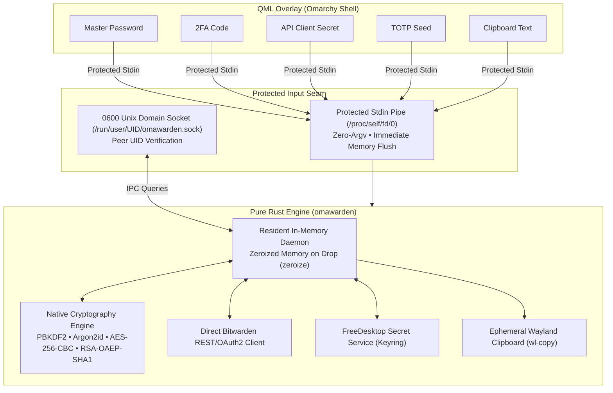

# omarchy-bitwarden

[](LICENSE)
[](https://www.rust-lang.org/)
[](https://github.com/omarchy)
[](README.zh-CN.md)

> A blazing fast, zero-bloat, and security-first Bitwarden / Vaultwarden overlay for **Omarchy Shell** on Hyprland.

Powered by a dedicated pure Rust engine (`omawarden`), `omarchy-bitwarden` delivers sub-millisecond credential lookups, minimal memory overhead, and rigorous process isolation—designed from the ground up to replace heavy Electron apps and sluggish Node CLI tooling with a native, Spotlight-style keyboard workflow.


---

## Why omarchy-bitwarden?

| Dimension                | omarchy-bitwarden (`omawarden`)                              | Official Desktop App (Electron) | Official CLI (`bw`)                   |
| :----------------------- | :----------------------------------------------------------- | :------------------------------ | :------------------------------------ |
| **Response Latency**     | **Sub-millisecond** (resident in-memory IPC socket)          | Slow UI render (1.5s - 3s)      | Heavy Node.js startup delay           |
| **Memory Footprint**     | **Lightweight daemon (~10MB base / ~60-80MB with Argon2id)** | 200MB - 400MB+ Chromium bloat   | Transient, high peak memory           |
| **Process Security**     | **Zero-leakage** (protected stdin & 0600 socket)             | Broad webview memory exposure   | Secrets prone to `argv`/`ps` snooping |
| **Lock-Screen Sync**     | **Native D-Bus / Hyprlock hooks**                            | App idle timeout only           | None (manual lock required)           |
| **Runtime Dependencies** | **100% standalone binary** (Zero external deps)              | Full Chromium/Node runtime      | Node.js environment required          |
---

## Keyboard Shortcuts

| Shortcut                       | Description                                                               |
| :----------------------------- | :------------------------------------------------------------------------ |
| <kbd>Enter</kbd>               | Copy primary credential (Password / Card Number / Public Key)             |
| <kbd>Ctrl</kbd> + <kbd>U</kbd> | Copy username                                                             |
| <kbd>Ctrl</kbd> + <kbd>T</kbd> | Copy live TOTP code                                                       |
| <kbd>Ctrl</kbd> + <kbd>O</kbd> | Open primary website URL in default browser                               |
| <kbd>Ctrl</kbd> + <kbd>K</kbd> | Open Action Palette (Copy username, TOTP, PIN, Org Name, etc.)            |
| <kbd>Ctrl</kbd> + <kbd>,</kbd> | Open / Toggle Settings configuration view                                 |
| <kbd>Ctrl</kbd> + <kbd>L</kbd> | Manually lock the vault immediately                                       |
| <kbd>Ctrl</kbd> + <kbd>R</kbd> | Trigger manual vault sync with Bitwarden server                           |
| <kbd>↓</kbd> / <kbd>↑</kbd>    | Navigate item list or action options (stops at boundaries)                |
| <kbd>Tab</kbd>                 | Switch category filters (All, Logins, Cards, Identities, Notes, SSH Keys) |
| <kbd>Esc</kbd>                 | Dismiss Action Palette, Settings, or hide the overlay                     |

---

## Prerequisites

Ensure the following tools are available on your system:

- **Keyring / Secret Service**: `secret-tool` (`libsecret` package on Arch/Debian/Fedora)
- **Wayland Clipboard**: `wl-clipboard` (`wl-copy` / `wl-paste`)

---

## Installation & Setup

1. **Install Plugin via Omarchy CLI**:

```bash
omarchy plugin add https://github.com/icyleaf/omarchy-bitwarden.git --enable
```

2. **Bind Global Hotkey & Window Rule** (in `~/.config/hypr/bindings.lua`):

```lua
-- ~/.config/hypr/bindings.lua
o.bind("SUPER + slash", "Omarchy Bitwarden", "omarchy-shell shell toggle icyleaf.bitwarden")

o.window({ class = "org.quickshell", title = "(Bitwarden)" }, {
  float = true,
  center = true,
  size = { 1152, 768 }
})
```

## Update & Uninstall

- **Update Plugin**:

```bash
omarchy plugin update icyleaf.bitwarden
```

- **Uninstall Plugin**:

```bash
killall omawarden
omarchy plugin remove icyleaf.bitwarden
rm -rf ~/.config/omarchy/hooks/system-lock.d/99-bitwarden-lock.sh
```

---

## Authentication Methods

`omarchy-bitwarden` supports two authentication methods for connecting to Bitwarden or self-hosted Vaultwarden instances:

### 1. Master Password Login (+ 2FA Support)

- **Default & Direct**: Enter your account email and Master Password directly in the overlay login form.
- **Two-Factor Authentication (2FA)**: If your account has two-step login enabled, an inline **2FA Code** field will appear automatically upon challenge. Enter your 6-digit TOTP code (or email verification code) to complete authentication.
- **Remember Email**: Optionally toggle "Remember Email" to prefill your login email address across sessions.

### 2. API Key Login (Personal API Key)

- **Official Bitwarden CLI Standard**: Recommended for headless environments or accounts with hardware key / Duo 2FA.
- **How to obtain**:
  1. Open the [Bitwarden Web Vault](https://vault.bitwarden.com) (or your self-hosted Vaultwarden instance).
  2. Navigate to **Settings** → **Security** → **Keys** tab.
  3. Click **View API Key** and enter your master password.
  4. Copy your `client_id` (e.g. `user.xxxxxxxx-xxxx-xxxx-xxxx-xxxxxxxxxxxx`) and `client_secret`.
- **In Omarchy Overlay**: Switch the login tab to **API Key**, paste your `client_id` and `client_secret`, and log in. Once authenticated, subsequent unlocks are completed via your Master Password.

---

## Security Architecture & Privacy Safeguards

`omarchy-bitwarden` is engineered with a strict **zero-trust, descriptor-isolated security model** to protect your credentials from process snooping, memory dumps, and environment leakage on Linux:



### Key Security Guarantees:

1. **Zero Command-Line (`argv`) Credential Leakage**: Master passwords, client secrets, 2FA codes, TOTP seeds, and clipboard text are **never passed as command-line arguments**. By delivering all sensitive data exclusively through protected `stdin` streams or `0600` Unix domain sockets, command line inspection reveals zero sensitive credentials.
2. **Zero Process Environment (`env`) Secret Spillage**: API client secrets, passwords, and live session tokens are never exported to process environment variables (`/proc/<pid>/environ`).
3. **Strict Owner-Only File & Socket Permissions (`0600`)**: Vault cache file (`~/.config/omarchy/plugins/icyleaf.bitwarden/data.json`) and the daemon Unix socket (`/run/user/<UID>/omawarden.sock`) enforce `0600` permissions (readable and writable exclusively by the owner).
4. **Deterministic Zero-Memory Destruction (`zeroize`)**: All cryptographic keys (`SymmetricCryptoKey`), derived master keys, and intermediate hashes implement `zeroize::ZeroizeOnDrop` to overwrite volatile memory with zeros upon drop. When the vault is locked, all decrypted items and keys are immediately purged from daemon memory.
5. **Native FreeDesktop Secret Service Keyring Lifecycle**: Encrypted session tokens are stored securely inside the system Keyring (GNOME Keyring / KWallet / KeePassXC) via D-Bus Secret Service protocols. **No cleartext master passwords are ever written to disk**. Immediate session destruction occurs on lock (<kbd>Ctrl</kbd>+<kbd>L</kbd>), screen-lock events (`hyprlock`/`swaylock`), or idle timeout.
6. **Ephemeral Clipboard Auto-Clearing (30s TTL)**: When copying passwords, TOTP codes, card CVVs, or SSH private keys, sensitive values are piped directly to `wl-copy` without entering shell logs. A dedicated timer daemon automatically clears the Wayland clipboard after 30 seconds (configurable in Settings).
7. **Zero External Runtime Dependencies**: 100% pure Rust binary. No external Node.js, Python, or official `bw` CLI binary is required at runtime.

---

## Roadmap

### Phase 1: Completed (Fast Lookup & Core Security)

- [x] In-memory caching & sub-millisecond fuzzy search
- [x] Full Argon2id / PBKDF2 / AES-256-CBC / RSA-OAEP native decryption
- [x] Real-time live RFC 6238 TOTP token engine & visual countdown
- [x] Screen-lock auto-lock hook & FreeDesktop Secret Service Keyring integration
- [x] Ephemeral Wayland clipboard manager with 30s auto-clear TTL
- [x] Encrypted binary attachment downloads & inline previews (images & text)
- [x] SSH key management (Ed25519/RSA/ECDSA generation, file import & export)
- [x] Multi-organization & collection key unwrapping with badges
- [x] Self-hosted Vaultwarden & personal API key / 2FA login support
- [x] Dual-channel structured logging & privacy-redacted diagnostics

### Phase 2: In Progress / Upcoming (Full Vault Item Lifecycle & Editing)

- [ ] Vault item creation (Add Login, Card, Identity, Secure Note)
- [ ] Built-in secure password & passphrase generator
- [ ] In-place item editing & custom fields modification
- [ ] Folder & collection reassignment
- [ ] Secure item deletion & soft-delete (Recycle Bin) management

### Phase 3: Future

- [ ] Wayland auto-type / auto-fill integration (e.g. via `ydotool` / `wtype`)
- [ ] Quick biometric / PAM / Fingerprint system unlock

---

## License

This project is open-sourced under the [MIT License](LICENSE).
