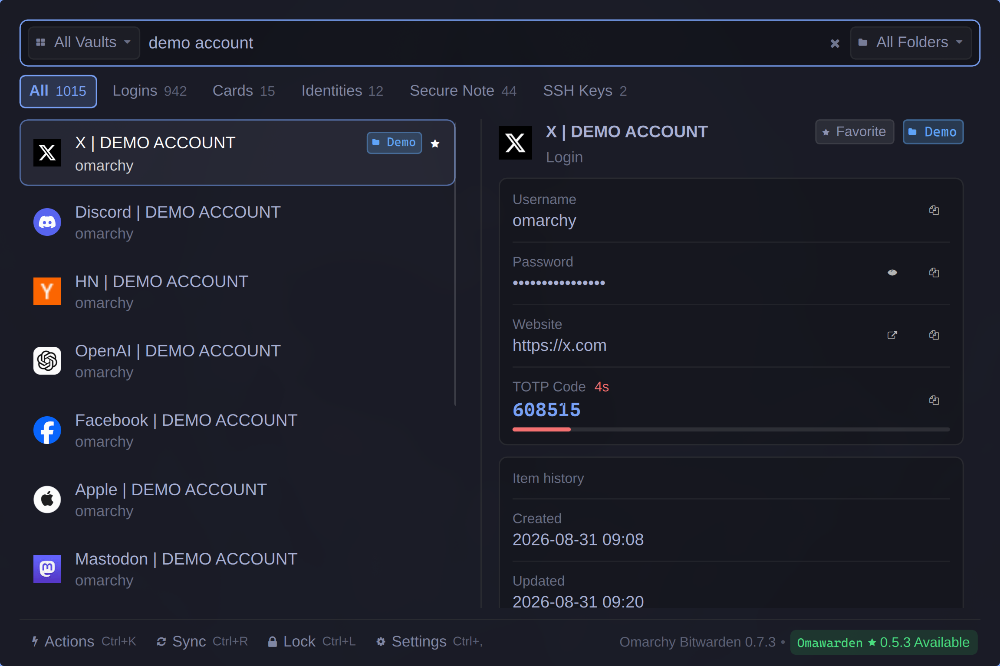
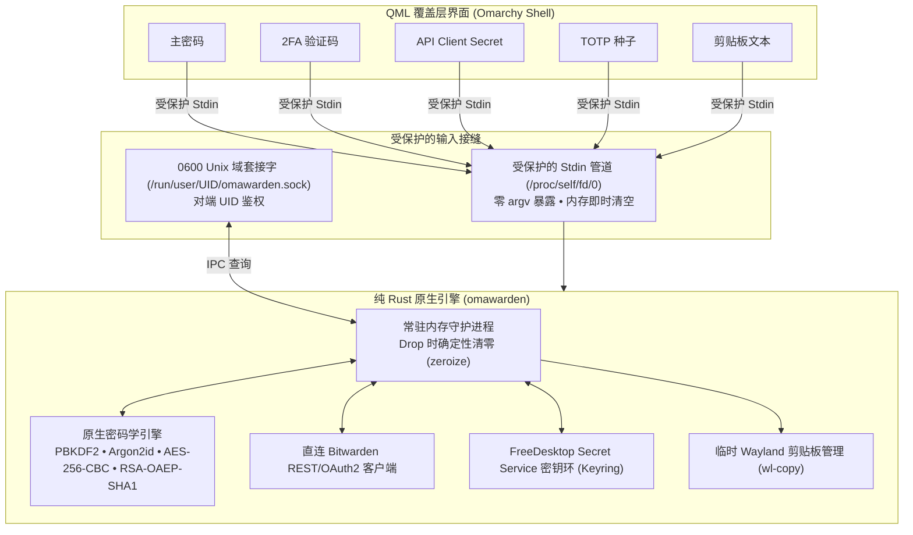

# omarchy-bitwarden

[](LICENSE)
[](https://www.rust-lang.org/)
[](https://github.com/omarchy)
[](README.md)

> 专为 Wayland & Hyprland 上的 **Omarchy Shell** 打造的极速、轻量、安全优先的 Bitwarden / Vaultwarden 覆盖层插件。

基于纯 Rust 原生引擎（`omawarden`），`omarchy-bitwarden` 提供亚毫秒级的凭据检索响应、极低的内存开销与严苛的进程隔离设计——旨在彻底替代臃肿的 Electron 桌面客户端与响应迟缓的 Node CLI 工具，为你带来原生的 Spotlight 式全键盘交互体验。



---

## 为什么选择 omarchy-bitwarden？

| 评估维度       | omarchy-bitwarden (`omawarden`)                    | 官方桌面端 (Electron)         | 官方命令行 (`bw`)           |
| :------------- | :------------------------------------------------- | :---------------------------- | :-------------------------- |
| **响应延迟**   | **亚毫秒级**（常驻内存 IPC 套接字）                | 界面渲染较慢（1.5 秒 - 3 秒） | 较重的 Node.js 启动延迟     |
| **内存开销**   | **轻量守护进程（基础 ~10MB / Argon2id ~60-80MB）** | 200MB - 400MB+ Chromium 占用  | 瞬时高内存峰值              |
| **进程安全**   | **零泄漏**（受保护的 stdin 与 0600 套接字管道）    | 广泛的 Webview 内存暴露       | 易受到 `argv`/`ps` 进程窥探 |
| **锁屏联动**   | **原生 D-Bus / Hyprlock 挂钩**                     | 仅依赖应用内闲置超时          | 无（需手动执行锁定）        |
| **运行时依赖** | **100% 独立二进制**（零外部运行时依赖）            | 完整的 Chromium/Node 运行环境 | 需要 Node.js 环境           |
---

## 常用快捷键

| 快捷键                         | 功能说明                                                   |
| :----------------------------- | :--------------------------------------------------------- |
| <kbd>Enter</kbd>               | 复制主要凭据（密码 / 卡号 / SSH 公钥）                     |
| <kbd>Ctrl</kbd> + <kbd>U</kbd> | 复制用户名                                                 |
| <kbd>Ctrl</kbd> + <kbd>T</kbd> | 复制实时 TOTP 动态验证码                                   |
| <kbd>Ctrl</kbd> + <kbd>O</kbd> | 在系统默认浏览器中打开登录网址                             |
| <kbd>Ctrl</kbd> + <kbd>K</kbd> | 打开动作面板（复制用户名、TOTP、PIN 码、组织名称等）       |
| <kbd>Ctrl</kbd> + <kbd>,</kbd> | 打开 / 切换设置面板                                        |
| <kbd>Ctrl</kbd> + <kbd>L</kbd> | 立即手动锁定密码库                                         |
| <kbd>Ctrl</kbd> + <kbd>R</kbd> | 触发与 Bitwarden 服务器的手动同步                          |
| <kbd>↓</kbd> / <kbd>↑</kbd>    | 列表或动作菜单导航（到达边界自动停止）                     |
| <kbd>Tab</kbd>                 | 切换分类标签（全部、登录、卡片、身份、安全备注、SSH 密钥） |
| <kbd>Esc</kbd>                 | 关闭动作面板、设置面板或隐藏覆盖层                         |

---

## 前置依赖

请确保系统中已安装以下基础工具：

- **密钥环 / 秘密服务 (Secret Service)**：`secret-tool`（Arch/Debian/Fedora 上的 `libsecret` 软件包）
- **Wayland 剪贴板管理**：`wl-clipboard`（提供 `wl-copy` / `wl-paste`）

---

## 安装与配置

1. **克隆或软链接至 Omarchy 插件目录**：

```bash
git clone https://github.com/icyleaf/omarchy-bitwarden.git ~/.config/omarchy/plugins/icyleaf.bitwarden
```

2. **重新扫描并加载 Omarchy Shell 插件**：

```bash
omarchy-shell shell rescanPlugins
```

3. **测试唤出覆盖层**：

```bash
omarchy-shell shell toggle icyleaf.bitwarden
```

4. **绑定全局快捷键**（在 `~/.config/hypr/bindings.lua` 中配置）：

```lua
-- ~/.config/hypr/bindings.lua
o.bind("SUPER + slash", "Omarchy Bitwarden", "omarchy-shell shell toggle icyleaf.bitwarden")
```

5. **配置窗口规则**（在 `~/.config/hypr/bindings.lua` 中配置）：

```lua
o.window({ class = "org.quickshell", title = "(Bitwarden)" }, {
  float = true,
  center = true,
  size = { 1152, 768 }
})
```

## 卸载

```bash
killall omawarden
omarchy plugin remove icyleaf.bitwarden
rm -rf ~/.config/omarchy/plugins/icyleaf.bitwarden
rm -rf ~/.config/omarchy/hooks/system-lock.d/99-bitwarden-lock.sh
```

---

## 身份认证方式

`omarchy-bitwarden` 支持两种连接 Bitwarden 或自建 Vaultwarden 的登录认证方式：

### 1. 主密码登录 (+ 2FA 双因素认证)

- **默认直连**：直接在覆盖层登录界面输入账户邮箱与主密码。
- **双因素认证 (2FA)**：如果账户开启了两步验证，界面会自动展开 **2FA Code** 输入框。输入 6 位 TOTP 动态码（或邮箱验证码）即可完成认证。
- **记住邮箱**：勾选“记住邮箱”可在后续会话中自动预填登录邮箱地址。

### 2. 个人 API Key 登录

- **Bitwarden 官方标准**：推荐用于无头环境、或启用了硬件安全密钥（FIDO2 / WebAuthn）/ Duo 2FA 的账户。
- **获取方式**：
  1. 打开 [Bitwarden Web Vault](https://vault.bitwarden.com)（或你的自建 Vaultwarden 网页端）。
  2. 进入 **设置 (Settings)** → **安全 (Security)** → **密钥 (Keys)** 页面。
  3. 点击 **查看 API 密钥 (View API Key)** 并输入主密码验证。
  4. 复制你的 `client_id`（如 `user.xxxxxxxx-xxxx-xxxx-xxxx-xxxxxxxxxxxx`）与 `client_secret`。
- **在覆盖层中登录**：切换登录标签至 **API Key**，粘贴对应凭据并登录。登录成功后，日常解锁仅需输入主密码即可。

---

## 安全架构与隐私保障

`omarchy-bitwarden` 采用严格的**零信任、文件描述符隔离安全模型**，全面防护 Linux 环境下的进程窥探、内存转储与环境变量泄露：



### 关键安全机制：

1. **零命令行参数（`argv`）凭据泄露**：主密码、API 密钥、2FA 验证码、TOTP 种子与剪贴板文本**绝不作为命令行参数传递**。所有敏感数据均通过受保护的 `stdin` 数据流或 `0600` Unix 域套接字传输，彻底杜绝 `/proc/<pid>/cmdline` 窥探。
2. **零环境变量（`env`）秘密溢出**：API Client Secret、密码与会话令牌绝不导出到进程环境变量（`/proc/<pid>/environ`）。
3. **严格仅所有者访问权限（`0600`）**：密码库缓存文件（`~/.config/omarchy/plugins/icyleaf.bitwarden/data.json`）与守护进程套接字（`/run/user/<UID>/omawarden.sock`）强制执行 `0600` 权限（仅当前用户 UID 可读写）。
4. **确定性内存清零销毁（`zeroize`）**：所有对称加密密钥（`SymmetricCryptoKey`）、派生主密钥及中间哈希均实现 `zeroize::ZeroizeOnDrop`，在使用结束或离开作用域时以零字节覆写内存。锁定密码库时会立即从常驻内存中清除所有已解密条目与密钥。
5. **原生 FreeDesktop 密钥环生命周期**：解密后的会话令牌安全保存在系统密钥环中（GNOME Keyring / KWallet / KeePassXC）。**绝不在磁盘中写入任何明文主密码**。在手动锁定（<kbd>Ctrl</kbd>+<kbd>L</kbd>）、系统锁屏事件（`hyprlock`/`swaylock`）或闲置超时触发时，立即销毁密钥环中的会话并清空常驻内存。
6. **阅后即焚剪贴板（30 秒 TTL 自动清除）**：复制密码、TOTP、信用卡安全码或 SSH 私钥时，内容直接管道传输至 `wl-copy` 而不进入 Shell 历史。专用定时器会在 30 秒后自动清空 Wayland 剪贴板（可在设置中自定义时长）。
7. **零外部运行时依赖**：100% 纯 Rust 编译二进制文件。运行期无需安装 Node.js、Python 或官方 `bw` CLI。

---

## 路线图

### 阶段一：已完成（快速检索与核心安全）

- [x] 内存缓存与亚毫秒级模糊搜索
- [x] 完整的 Argon2id / PBKDF2 / AES-256-CBC / RSA-OAEP 原生密码学解密
- [x] 实时 RFC 6238 TOTP 动态验证码生成与视觉倒计时
- [x] 系统锁屏挂钩与 FreeDesktop Secret Service 密钥环生命周期联动
- [x] 阅后即焚式 Wayland 剪贴板管理（30 秒 TTL 自动清除）
- [x] 加密二进制附件下载与内联预览（图片与文本）
- [x] SSH 密钥生命周期管理（Ed25519/RSA/ECDSA 密钥对生成、文件导入与安全导出）
- [x] 多组织与集合密钥自动解密及徽标分类展示
- [x] 自建 Vaultwarden 实例、个人 API Key 及 2FA 登录支持
- [x] 双通道结构化日志与脱敏诊断信息导出

### 阶段二：进行中 / 近期规划（完整密码库条目生命周期与编辑）

- [ ] 密码库条目新建（添加登录凭据、卡片、身份、安全备注）
- [ ] 内置高强度密码与口令短语生成器
- [ ] 条目就地编辑与自定义字段修改
- [ ] 文件夹与组织集合重新归属分类
- [ ] 条目安全删除与回收站（软删除）管理

### 阶段三：远期规划

- [ ] Wayland 自动填充 / 模拟按键输入（例如基于 `ydotool` / `wtype` 集成）
- [ ] 快速生物识别 / PAM / 指纹系统级解锁

---

## 开源许可

本项目基于 [MIT License](LICENSE) 开源发布。
