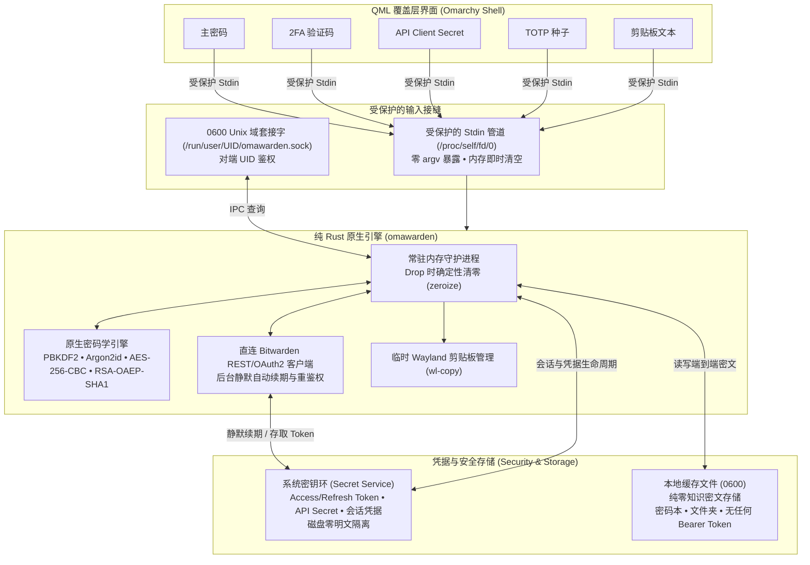

# omarchy-bitwarden

[](LICENSE)
[](https://www.rust-lang.org/)
[](https://github.com/omarchy)
[](README.md)

> 专为 Wayland & Hyprland 上的 **Omarchy Shell** 打造的极速、轻量、安全优先的 Bitwarden / Vaultwarden 覆盖层插件。

基于纯 Rust 原生引擎（`omawarden`），`omarchy-bitwarden` 提供亚毫秒级的凭据检索响应、极低的内存开销与严苛的进程隔离设计——旨在彻底替代臃肿的 Electron 桌面客户端与响应迟缓的 Node CLI 工具，为你带来原生的 Spotlight 式全键盘交互体验。


---

## 为什么选择 omarchy-bitwarden？

| 评估维度             | omarchy-bitwarden (`omawarden`)                         | 官方桌面端 (Electron)          | 官方命令行 (`bw`)                                            |
| :------------------- | :------------------------------------------------------ | :----------------------------- | :----------------------------------------------------------- |
| **响应延迟**         | **亚毫秒级**（常驻内存 IPC 套接字）                     | 界面渲染较慢（1.5 秒 - 3 秒）  | 较重的 Node.js 启动延迟                                      |
| **内存开销**         | **轻量守护进程（基础 ~10MB / Argon2id ~60-80MB）**      | 200MB - 400MB+ Chromium 占用   | 瞬时高内存峰值                                               |
| **进程安全**         | **零泄漏**（受保护的 stdin 与 0600 套接字管道）         | 广泛的 Webview 内存暴露        | 易受到 `argv`/`ps` 进程窥探                                  |
| **Token 与凭据存储** | **系统密钥环安全隔离**（本地缓存文件零明文 Token）     | 平台 Keychain / Electron 存储  | 曾默认明文写入本地缓存文件，或依赖不安全且易泄漏的 `BW_SESSION` 环境变量 |
| **本地数据缓存**     | **纯零知识密文缓存**（离线毫秒级检索，无解密凭据）      | 本地缓存文件与认证凭据混杂                          | 本地缓存文件与认证凭据混杂                                     |
| **Token 到期处理**   | **仅需主密码解锁，免重复登录**（后台静默续期 Token，无需频繁重输 API Key） | 桌面端支持记住登录，主要依赖主密码解锁 | 2 小时 Token 硬过期报 `Session expired`，需频繁手动重新登录 |
| **锁屏联动**         | **守护进程原生自动检测（Omarchy 锁屏、Hyprlock、D-Bus/logind 睡眠与挂起）** | 仅依赖应用内闲置超时           | 无（需手动执行锁定）                                         |
| **运行时依赖**       | **100% 独立二进制**（零外部运行时依赖）                 | 完整的 Chromium/Node 运行环境  | 需要 Node.js 环境                                            |

### 为什么自研 omawarden 而非直接采用 rbw？

`rbw` 是 Linux 生态中极其优秀的非官方 Rust 命令行客户端，开创了零知识常驻守护进程架构，为 `omawarden` 提供了重要启发。两者在内存安全上有着共同的高标准，均实现了物理内存锁定（`mlock`）与退出即时清零（`zeroize`）。

两者的差异并非“命令行 vs 桌面”，而是**面对同样的 Bitwarden 服务，在功能完整度、系统依赖与工作流上做出了不同的设计取舍**：

#### 核心特性对比

| 评估维度 | `omawarden`（内置引擎 & 独立 CLI） | `rbw`（非官方 Rust 命令行） |
| :--- | :--- | :--- |
| **条目类型支持深度** | **五大类型一等公民支持**：为登录、银行卡（CVV/卡号）、身份、便签及 SSH 密钥提供专用提取命令与结构化展示 | 主要面向登录密码与 TOTP；查看银行卡/身份等条目需使用 `--raw` 输出原始 JSON 自行提取 |
| **加密附件处理** | **原生支持**：支持下载加密 Blob 并解密预览/导出 | **不支持**（参见长期未决 Issue [doy/rbw#130](https://github.com/doy/rbw/issues/130)） |
| **密码历史记录** | **原生支持**：可解密并查看条目历史修改过的旧密码 | **不支持**查看历史密码 |
| **多组织与集合** | **完整支持**：`RSA-OAEP-SHA1` 组织密钥解包，支持多组织与集合过滤 | **基础支持**：以个人密码库为主，多组织与集合管理较弱（参见 [doy/rbw#351](https://github.com/doy/rbw/issues/351)） |
| **SSH 密钥能力** | **密钥对生成与管理**：支持本地生成 Ed25519/RSA 密钥对、计算指纹并导出文件 | **OpenSSH Agent 代理**：实现 `SSH_AUTH_SOCK` 协议，私钥无需落盘直接充当系统 ssh 签名代理（但不支持生成密钥对） |
| **锁屏安全联动** | **主动监听系统锁屏与睡眠**：电脑合盖或锁屏（Hyprlock/Omarchy/D-Bus）瞬时抹除内存凭据并锁定 | **被动闲置超时倒计时**：合盖休眠期间若未超时，凭据依然驻留内存 |
| **身份交互与凭据存储** | **系统密钥环（Keyring）深度集成**：后台无感静默刷新 Token，日常使用免频繁弹窗 | **GnuPG / pinentry 交互**：依靠系统的 pinentry（支持纯终端 `pinentry-curses`），不依赖桌面密钥环 |
| **图形界面 IPC 对接** | **专用结构化 JSON IPC 套接字**：专为桌面 Overlay 瞬时全量吞吐设计 | 纯文本标准输入输出，专为终端管道设计 |

#### omawarden 目前相比 rbw 的不足之处

在以下场景中，`rbw` 具有明显优势，读者可根据自身需求合理选型：
1. **发行版生态与打包成熟度**：`rbw` 已经进入 Arch、Debian、Fedora、Alpine、NixOS 等各大主流发行版的官方源，一行命令即可全局安装；`omawarden` 目前主要通过 AUR 和 GitHub 发布，尚未被各主流发行版官方源收录。
2. **纯无头环境（Headless / Server）兼容性**：`rbw` 配合 `pinentry-curses` 在纯字符终端、服务器或没有 Secret Service 密钥环服务的极简容器中开箱即用；`omawarden` 强依赖桌面 Secret Service 密钥环服务实现安全存储。
3. **OpenSSH Agent 实时代理**：`rbw` 能直接充当 `SSH_AUTH_SOCK`，日常执行 `ssh` 或 `git` 时私钥零落盘直接签名；`omawarden` 尚未实现 OpenSSH Agent 协议服务，目前侧重于密钥生成与本地导出管理。
4. **终端内交互式条目编辑**：`rbw` 提供 `rbw edit` 等命令可随时唤起终端编辑器修改密码库；`omawarden` 目前主要聚焦于检索、提取、复制与生成流程，在终端内直接编辑写回远端的功能暂未支持（已列入后续规划）。

---

## 常用快捷键

| 快捷键                                 | 功能说明                                                   |
| :------------------------------------- | :--------------------------------------------------------- |
| <kbd>Enter</kbd>                       | 复制主要凭据（密码 / 卡号 / SSH 公钥）                     |
| <kbd>Ctrl</kbd> + <kbd>Enter</kbd>     | 复制实时 TOTP 动态验证码                                   |
| <kbd>Ctrl</kbd> + <kbd>U</kbd>         | 复制用户名                                                 |
| <kbd>Ctrl</kbd> + <kbd>T</kbd>         | 切换字段/秘密明文与掩码展示（密码、密钥、卡号等）          |
| <kbd>Ctrl</kbd> + <kbd>H</kbd>         | 查看当前登录项的历史密码记录                               |
| <kbd>Ctrl</kbd> + <kbd>O</kbd>         | 在系统默认浏览器中打开登录网址                             |
| <kbd>Ctrl</kbd> + <kbd>K</kbd>         | 打开动作面板（复制用户名、TOTP、PIN 码、密码历史等）       |
| <kbd>Ctrl</kbd> + <kbd>,</kbd>         | 打开 / 切换设置面板                                        |
| <kbd>Ctrl</kbd> + <kbd>L</kbd>         | 立即手动锁定密码库                                         |
| <kbd>Ctrl</kbd> + <kbd>R</kbd>         | 触发与 Bitwarden 服务器的手动同步                          |
| <kbd>↓</kbd> / <kbd>↑</kbd>            | 列表或动作菜单导航（到达边界自动停止）                     |
| <kbd>Tab</kbd>                         | 切换分类标签（全部、登录、卡片、身份、安全备注、SSH 密钥） |
| <kbd>Alt</kbd> + <kbd>V</kbd>          | 切换或循环密码库/组织作用域筛选（全部、个人、各组织）       |
| <kbd>Alt</kbd> + <kbd>F</kbd>          | 切换或循环文件夹作用域筛选（全部文件夹、指定文件夹）       |
| <kbd>Esc</kbd>                         | 关闭动作面板、历史记录、设置面板或隐藏覆盖层               |

---

## 前置依赖

请确保系统中已安装以下基础工具：

- **密钥环 / 秘密服务 (Secret Service)**：`secret-tool`（Arch/Debian/Fedora 上的 `libsecret` 软件包）
- **Wayland 剪贴板管理**：`wl-clipboard`（提供 `wl-copy` / `wl-paste`）

---

## 安装与配置

1. **通过 Omarchy CLI 一键安装并启用**：

```bash
omarchy plugin add https://github.com/icyleaf/omarchy-bitwarden.git --enable
```

2. **配置全局快捷键与窗口规则**（在 `~/.config/hypr/bindings.lua` 中配置）：

```lua
-- ~/.config/hypr/bindings.lua
o.bind("SUPER + slash", "Omarchy Bitwarden", "omarchy-shell shell toggle icyleaf.bitwarden")

o.window({ class = "org.quickshell", title = "(Bitwarden)" }, {
  float = true,
  center = true,
  size = { 1152, 768 }
})
```

## 更新与卸载

- **更新插件**：

```bash
omarchy plugin update icyleaf.bitwarden
```

- **卸载插件**：

```bash
killall omawarden
omarchy plugin remove icyleaf.bitwarden
```

---

## 身份认证方式

`omarchy-bitwarden` 支持两种连接 Bitwarden 或自建 Vaultwarden 的登录认证方式：

### 1. 主密码登录 (+ 2FA 双因素认证)

- **默认直连**：直接在覆盖层登录界面输入账户邮箱与主密码。
- **双因素认证 (2FA)**：如果账户开启了两步验证，界面会自动展开 **2FA Code** 输入框。输入 6 位 TOTP 动态码（或邮箱验证码）即可完成认证。
- **记住邮箱**：勾选“记住邮箱”可在后续会话中自动预填登录邮箱地址。

### 2. 个人 API Key 登录

- **Bitwarden 官方标准**：推荐用于无头环境、或启用了硬件安全密钥（FIDO2 / WebAuthn）/ Duo 2FA 的账户。
- **获取方式**：
  1. 打开 [Bitwarden Web Vault](https://vault.bitwarden.com)（或你的自建 Vaultwarden 网页端）。
  2. 进入 **设置 (Settings)** → **安全 (Security)** → **密钥 (Keys)** 页面。
  3. 点击 **查看 API 密钥 (View API Key)** 并输入主密码验证。
  4. 复制你的 `client_id`（如 `user.xxxxxxxx-xxxx-xxxx-xxxx-xxxxxxxxxxxx`）与 `client_secret`。
- **在覆盖层中登录**：切换登录标签至 **API Key**，粘贴对应凭据并登录。登录成功后，日常解锁仅需输入主密码即可。
- **密钥环持久化与静默续期**：你的 `client_secret` 安全保存在系统密钥环中（绝不以明文落盘）。当短期 2 小时 Access Token 到期时，`omawarden` 会在后台自动完成静默续期重鉴权，不会打断同步或强制退回重登。

---

## 安全架构与隐私保障

`omarchy-bitwarden` 采用严格的**零信任、文件描述符隔离安全模型**，全面防护 Linux 环境下的进程窥探、内存转储与环境变量泄露：



### 关键安全机制：

1. **零命令行参数（`argv`）凭据泄露**：主密码、API 密钥、2FA 验证码、TOTP 种子与剪贴板文本**绝不作为命令行参数传递**。所有敏感数据均通过受保护的 `stdin` 数据流或 `0600` Unix 域套接字传输，彻底杜绝 `/proc/<pid>/cmdline` 窥探。
2. **零环境变量（`env`）秘密溢出**：API Client Secret、密码与会话令牌绝不导出到进程环境变量（`/proc/<pid>/environ`）。
3. **严格仅所有者访问权限（`0600`）与 Peer UID 校验**：本地密码库缓存文件、下载解密的附件及常驻守护进程套接字（`/run/user/<UID>/omawarden.sock`）强制执行 `0600` 权限，并通过内核级 `SO_PEERCRED` 校验对端 UID，实现跨系统用户的强隔离。注：在 Linux 系统中，同一 OS 用户身份下运行的进程默认共享 UID 权限；针对同机不可信用户进程的隔离建议配合沙盒（如 Bubblewrap/Flatpak）。
4. **确定性主密钥内存清零销毁（`zeroize`）**：所有对称加密密钥（`SymmetricCryptoKey`）、派生主密钥及中间密码学缓冲区均实现 `zeroize::ZeroizeOnDrop`，在使用结束或离开作用域时以零字节覆写内存。锁定密码库时会立即清空并释放常驻内存中的所有已解密条目。
5. **原生 FreeDesktop 密钥环生命周期**：Bearer Token（Access/Refresh Token）、API 密钥（Client Secret）以及会话凭据均安全隔离于系统密钥环（GNOME Keyring / KWallet / KeePassXC）中。**本地缓存文件纯粹作为零知识密文存储，绝无任何明文 Bearer Token 或主密码落盘**。在手动锁定（<kbd>Ctrl</kbd>+<kbd>L</kbd>）、系统锁屏事件（`hyprlock`/`swaylock`）或闲置超时触发时，立即销毁密钥环中的会话并清空常驻内存。
6. **阅后即焚剪贴板（30 秒 TTL 自动清除）**：复制密码、TOTP、信用卡安全码或 SSH 私钥时，内容直接管道传输至 `wl-copy` 而不进入 Shell 历史。专用定时器会在 30 秒后自动清空 Wayland 剪贴板（可在设置中自定义时长）。
7. **零外部运行时依赖**：100% 纯 Rust 编译二进制文件。运行期无需安装 Node.js、Python 或官方 `bw` CLI。

---

## 路线图

### 阶段一：已完成（快速检索与核心安全）

- [x] 内存缓存与亚毫秒级模糊搜索
- [x] 完整的 Argon2id / PBKDF2 / AES-256-CBC / RSA-OAEP 原生密码学解密
- [x] 实时 RFC 6238 TOTP 动态验证码生成与视觉倒计时
- [x] 系统锁屏挂钩与 FreeDesktop Secret Service 密钥环生命周期联动
- [x] 多槽位系统密钥环凭据持久化与后台静默自动重鉴权
- [x] 阅后即焚式 Wayland 剪贴板管理（30 秒 TTL 自动清除）
- [x] 加密二进制附件下载与内联预览（图片与文本）
- [x] SSH 密钥生命周期管理（Ed25519/RSA/ECDSA 密钥对生成、文件导入与安全导出）
- [x] 多维度密码库（个人/各组织）与文件夹作用域筛选（支持快捷键循环切换）
- [x] 多组织与集合密钥自动解密及徽标分类展示
- [x] 动作面板（<kbd>Ctrl</kbd>+<kbd>K</kbd>）与密码历史记录查看器（<kbd>Ctrl</kbd>+<kbd>H</kbd>）
- [x] FIDO2 / WebAuthn Passkey 凭据标识与条目创建/修改时间历史
- [x] 锁定状态后台同步（支持在登录且锁定时安全同步最新端到端密文）
- [x] 自建 Vaultwarden 实例、个人 API Key 及 2FA 登录支持
- [x] 双通道结构化日志与脱敏诊断信息导出

### 阶段二：进行中 / 近期规划（完整密码库条目生命周期与编辑）

- [ ] 密码库条目新建（添加登录凭据、卡片、身份、安全备注）
- [ ] 内置高强度密码与口令短语生成器
- [ ] 条目就地编辑与自定义字段修改
- [ ] 文件夹与组织集合重新归属分类
- [ ] 条目安全删除与回收站（软删除）管理

### 阶段三：远期规划

- [ ] Wayland 自动填充 / 模拟按键输入（例如基于 `ydotool` / `wtype` 集成）
- [ ] 快速生物识别 / PAM / 指纹系统级解锁

---

## 贡献指南

我们非常欢迎社区的各类贡献！为了确保顺畅的协作体验并支持基于 `git-cliff` 的自动化变更日志生成，请遵循以下开发流程：

1. **基于 `develop` 分支开发**：`main` 分支仅保留给已打标签的稳定发行版。所有特性开发、问题修复与代码重构均应从 `develop` 分支切出：
   ```bash
   git checkout develop && git pull
   git checkout -b <type>/<short-description>
   # 类型前缀：feat/, fix/, chore/, refactor/, sec/
   ```
2. **本地验证**：在提交前确保代码格式化、Lint 检查和测试全部通过：
   ```bash
   cd omawarden
   cargo fmt --check
   cargo clippy --all-targets --all-features -- -D warnings
   XDG_RUNTIME_DIR=/tmp cargo test
   ```
   *(可选)* 如果已安装 [`mise`](https://mise.jdx.dev/)，可直接使用 `mise run build` 或 `mise run dev-deploy` 进行本地联调与部署。
3. **提交信息规范**：编写符合 Conventional Commits 规范的 Commit（如 `feat(daemon): ...`、`fix(ui): ...`）。
4. **向 `develop` 提交 PR**：创建 Pull Request 并指定基准分支（base branch）为 `develop`。

完整开发与贡献细节请参阅 [CONTRIBUTING.md](CONTRIBUTING.md)。

---

## 致谢 / Credits

`omarchy-bitwarden` 得益于开源社区的优秀成果与深厚积淀，特别致谢：

- **[Bitwarden CLI (`bw`)](https://github.com/bitwarden/clients)**：感谢 Bitwarden 官方团队提供的完整协议设计、数据模型与标准参考客户端。
- **[rbw](https://github.com/doy/rbw)**：衷心感谢 `rbw` 开创性地实现了基于 Rust 的高性能零知识常驻 daemon 架构，为 `omawarden` 的核心设计带来了重要启发与实现灵感。

---

## 开源许可

本项目基于 [MIT License](LICENSE) 开源发布。
